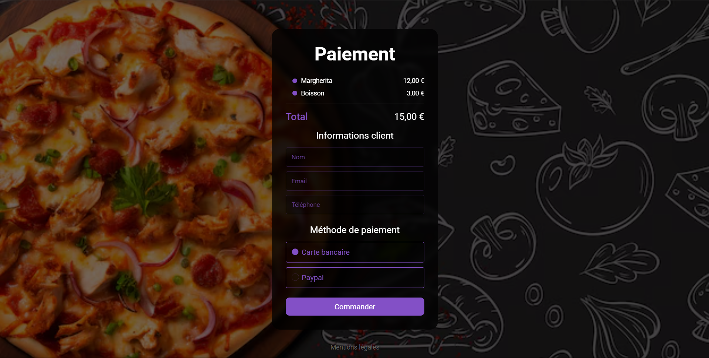

## 🎨 Changement de thème

Un système de changement de thème (clair/sombre) est déjà en place.

### ✅ Ce qui est déjà fait

- La logique de basculement entre les thèmes est fonctionnelle.
- Le thème sélectionné est sauvegardé automatiquement dans le `localStorage`.

### ⚙️ Intégration du bouton

Pour activer le changement de thème sur l’interface, il suffit d’ajouter un **bouton de bascule** avec l’ID suivant :

```html
<button id="theme-toggler">Changer de thème</button>
```


## 🖼️ Aperçu

 